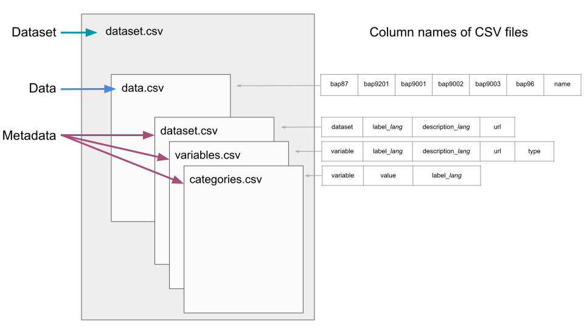

| Author: Xiaoyao Han, Claudia Saalbach, Knut Wenzig
| Affiliation: DIW Berlin
| Created: 2022-03-01
| Version: v1.0.0
| Last modified: 2022-04-14 Claudia Saalbach
| Licence: This repository is issued under a CC by licence (https://creativecommons.org/licenses/by/4.0/)

---

The Internal Open Data Format (Internal_OpenDF) holds a data component and a metadata component. Therefore this document describes the specification of the Internal_OpenDF in two main sections: [Data](#data) and [Metadata](#metadata). First, there will be information about how the data and the metadata component are organized by describing the used file format, structure, and variable types. The last section describes how the Internal_OpenDF implements the [Multilingual Feature](#multilingual-feature) regarding label and description attributes, e.g. for providing information on variables or the dataset.

To make it easier to follow the specification of the Internal_OpenDF, take a look at the (meta)data [example](example). There you will find data and metadata CSV files and a detailed description.

# Data

## Organization

### File Format

The Internal_OpenDF stores the data in a comma-separated values file. CSV files are that both human- and machine-readable. For opening a CSV file a simple text editor or a conventional spreadsheet program is enough. The following example shows the first five rows of the example data set ([data.csv](example/data.csv)) once in the view of a text editor and once in the view of a table program.

*First rows of the data.csv file in a text editor view*
```{r comment='', echo=FALSE, include=TRUE, tab.cap=c("TEST")}
cat(readLines('example/data.csv')[1:5], sep = '\n')
```

*First rows of the data.csv file in a spreadsheet program view*

```{r, echo=FALSE, include=TRUE}
knitr::kable(read.csv("example/data.csv",
                 header = TRUE,
                 sep=",",
                 colClasses = "character"
              )[1:4,]
             )
```

### Structure 

The data structure within the CSV file needs to be "tidy" that is, one variable forms a column, and one observation forms a row (see [Wickham, 2014](https://www.jstatsoft.org/article/view/v059i10)). For automatic processing of the dataset, the file name of the raw data set cannot be flexible and must always be `data.csv`. However, the column names can differ since the columns within the data.csv file are the variable names.

### Variable Types

The raw data can only contain numeric and character variables. In addition, social scientists often use categorical variables. Categorical variables are numeric variables where pre-defined labels are assigned to values. To deal with categorical variables additional metadata is required.

<!-- --------------------------------------------------------------------------- -->
<!-- --------------------------------------------------------------------------- -->
<!-- --------------------------------------------------------------------------- -->

# Metadata 

## Organization

The Internal_OpenDF organizes the metadata elements and attributes in three CSV files: 

* Metadata describing the dataset itself is stored in the [dataset.csv](example/dataset.csv) file. 
* Metadata describing each variable of the dataset is stored in the [variables.csv](example/variables.csv) file
* Metadata describing each variables categories is stored in the [categories.csv](example/categories.csv) file.




The [dataset.csv](example/dataset.csv) file holds four columns for assigning a 

1. dataset name (column: `dataset`), 
2. dataset label (column: `label_lang`),
3. dataset description (column: `description_lang`), and a
4. dataset url (column: `url`)

The [variables.csv](example/variables.csv) file holds five columns for assigning a 

1. variable name (column: `variable`),
2. variable label (column: `label_lang`),
3. variable description (column: `description_lang`),
4. variable url (column: `url`), and the
5. variable type (column: `type`)

The [categories.csv](example/categories.csv) file holds three columns for assigning  

1. values (column: `value`) and
2. value labels (column: `label_lang`) to

a variable. The column: `variable` holds the name of the variable the values and value labels belong to. This column works like a key.

However, not all columns must necessarily contain information. Columns that represent optional elements can stay empty. The [profile](profile) provides more detailed information about which elements, or attributes are mandatory and which are optional. 

### File Format

As for the [data component](#data), the Internal_OpenDF also saves the metadata as CSV files. CSV files for the Internal_OpenDF use commas as separators, UTF-8 encoding and at least quotes if a cell contains a comma.

### Structure

Also here the data structure within the CSV file must be "tidy". Supported variable types are numeric and character. The following example shows the first five rows of the ([variables.csv](example/variables.csv)) file that stores the variable metadata.

*First rows of the variables.csv file in a text editor view*
```{r comment='', echo=FALSE, include=TRUE, tab.cap=c("TEST")}
cat(readLines('example/variables.csv')[1:5], sep = '\n')
```

*First rows of the variables.csv file in a spreadsheet program view*

```{r, echo=FALSE, include=TRUE}
knitr::kable(read.csv("example/variables.csv",
                 header = TRUE,
                 sep=","
                 )[1:4,]
             )
```


# Multilingual Feature

The Internal_OpenDF allows multilingual labels and descriptions by using the *lang* suffix. This suffix holds the language code defined by the ISO 639-1 (https://de.wikipedia.org/wiki/Liste_der_ISO-639-1-Codes). For example, if a label is specified in English and in German, there will be both a column `label_en` and a column `label_de`. In this way, labels and descriptions can be specified in a variety of languages. The more languages there are, the more columns the CSV file contains.


