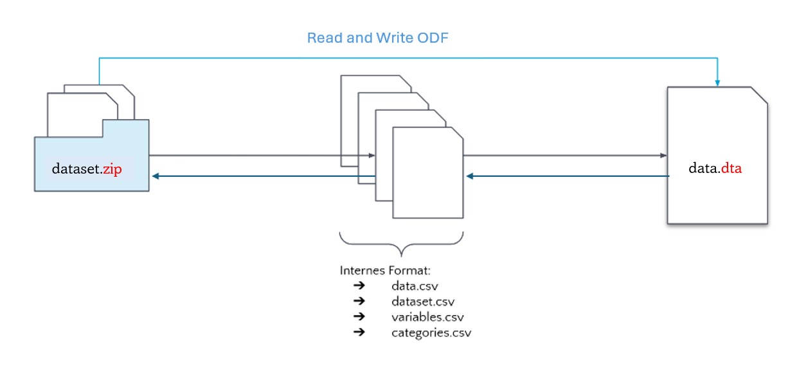
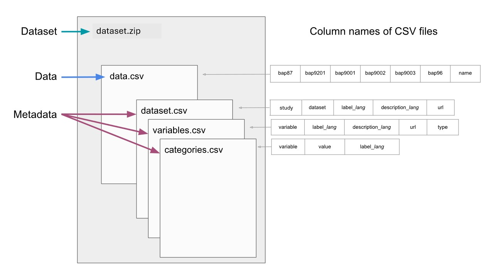

Generating Open Data Format
================

-   [Data](#data)
    -   [File Format](#file-format)
    -   [Structure](#structure)
    -   [Variable Types](#variable-types)
-   [Metadata](#metadata)
    -   [File Format](#file-format-1)
    -   [Structure](#structure-1)
-   [Multilingual Feature](#multilingual-feature)

Author: Xiaoyao Han, Tom Hartl, Claudia Saalbach, Knut Wenzig  
Affiliation: DIW Berlin  
Created: 2022-03-01  
Version: v1.0.0  
Last modified: 2024-08-01
Licence: This repository is issued under a CC by licence
(<https://creativecommons.org/licenses/by/4.0/>)

------------------------------------------------------------------------
This section introduces how to convert your native metadata to the standardized Open Data Format (ODF), which can be imported into various statistical software. To generate ODF based on the metadata specification, we recommend using an interval CSV format, referred to as the Internal Open Data Format (Internal_OpenDF). This format ensures compatibility with the majority of statistical software while maintaining both machine and human readability.

Alternatively, native dataset objects in R and Stata can be enriched with Metadata according to the ODF specification and converted to the Open Data Format using the export filters in the Software Packages.

The architecture of the conversion process, using the Stata package as an example, is illustrated in Figure 1. In this process, CSV files act as intermediaries between the native metadata and the ODF environment. If the metadata is provided in CSV files according to the ODF specification, it can then be effortlessly converted to ODF. Here, we will introduce the structure of the four CSV files and specify the required metadata elements for each.

{width=950}

The CSV files holds [Data](#data) and [Metadata](#metadata). Information about how the data and the metadata component are organized
is provided in the following. In addition, [Multilingual Feature](#multilingual-feature) regarding label and
description attributes is also introduced.

To make it easier to follow the sturcture of CSV metadata,
take a look at the (meta)data [example](example). There you will find
data and metadata CSV files and a detailed description. The mapping of the metadata elements of xml and CSV can be found in [profile](profile)

# Data

## File Format

The Internal\_OpenDF stores the data in a comma-separated values file.
CSV files are that both human- and machine-readable. For opening a CSV
file a simple text editor or a conventional spreadsheet program is
enough. The following example shows the first five rows of the example
data set ([data.csv](example/data.csv)) once in the view of a text
editor and once in the view of a table program.

*First rows of the data.csv file in a text editor view*

    bap87,bap9201,bap9001,bap9002,bap9003,bap96,name
    4,-2,1,-1,2,-2,Jakob
    3,5,-2,1,4,1.57,Luca
    ,-1,-1,2,-1,1.92,Emilia
    1,9,-2,2,4,1.85,-1

*First rows of the data.csv file in a spreadsheet program view*

| bap87 | bap9201 | bap9001 | bap9002 | bap9003 | bap96 | name   |
|:------|:--------|:--------|:--------|:--------|:------|:-------|
| 4     | -2      | 1       | -1      | 2       | -2    | Jakob  |
| 3     | 5       | -2      | 1       | 4       | 1.57  | Luca   |
|       | -1      | -1      | 2       | -1      | 1.92  | Emilia |
| 1     | 9       | -2      | 2       | 4       | 1.85  | -1     |

## Structure

The data structure within the CSV file needs to be “tidy” that is, one
variable forms a column, and one observation forms a row (see [Wickham,
2014](https://www.jstatsoft.org/article/view/v059i10)). For automatic
processing of the dataset, the file name of the raw data set cannot be
flexible and must always be `data.csv`. However, the column names can
differ since the columns within the data.csv file are the variable
names.

## Variable Types

The raw data can only contain numeric and character variables. In
addition, social scientists often use categorical variables. Categorical
variables are numeric variables where pre-defined labels are assigned to
values. To deal with categorical variables additional metadata is
required.

<!-- --------------------------------------------------------------------------- -->
<!-- --------------------------------------------------------------------------- -->
<!-- --------------------------------------------------------------------------- -->

# Metadata

The Internal\_OpenDF organizes the metadata elements and attributes in
three CSV files:

-   Metadata describing the dataset itself is stored in the
    [dataset.csv](example/dataset.csv) file.
-   Metadata describing each variable of the dataset is stored in the
    [variables.csv](example/variables.csv) file
-   Metadata describing each variables categories is stored in the
    [categories.csv](example/categories.csv) file.

{width=950}

The [dataset.csv](example/dataset.csv) file holds four columns for
assigning a

1.  dataset study (column: `study`),
2.  dataset name (column: `dataset`),
3.  dataset label (column: `label_lang`),
4.  dataset description (column: `description_lang`), and a
5.  dataset url (column: `url`)

The [variables.csv](example/variables.csv) file holds five columns for
assigning a

1.  variable name (column: `variable`),
2.  variable label (column: `label_lang`),
3.  variable description (column: `description_lang`),
4.  variable url (column: `url`), and the
5.  variable type (column: `type`)

The [categories.csv](example/categories.csv) file holds three columns
for assigning

1.  values (column: `value`) and
2.  value labels (column: `label_lang`) to

a variable. The column: `variable` holds the name of the variable the
values and value labels belong to. This column works like a key.

However, not all columns must necessarily contain information. Columns
that represent optional elements can stay empty. The [profile](profile)
provides more detailed information about which elements, or attributes
are mandatory and which are optional.

## File Format

As for the [data component](#data), the Internal\_OpenDF also saves the
metadata as CSV files. CSV files for the Internal\_OpenDF use commas as
separators, UTF-8 encoding and at least quotes if a cell contains a
comma.

## Structure

Also here the data structure within the CSV file must be “tidy”.
Supported variable types are numeric and character. The following
example shows the first five rows of the
([variables.csv](example/variables.csv)) file that stores the variable
metadata.

*First rows of the variables.csv file in a text editor view*

    variable,label_en,label_de,type,description_en,description_de,url
    bap87,Current Health,Gesundheitszustand gegenwärtig ,numeric,Question: How would you describe your current health?,Frage: Wie würden Sie Ihren gegenwärtigen Gesundheitszustand beschreiben?,https://paneldata.org/soep-core/data/bap/bap87
    bap9201,"hours of sleep, normal workday ","Stunden Schlaf, normaler Werktag ",numeric,Sleep hours per weekday,Schlafstunden pro Wochentag,https://paneldata.org/soep-core/data/bap/bap9201
    bap9001,Pressed For Time Last 4 Weeks ,"Eile, Zeitdruck letzten 4 Wochen ",numeric,Frequency of feeling time pressure in the past 4 weeks,Häufigkeit des Gefühls von Zeitdruck in den letzten 4 Wochen,https://paneldata.org/soep-core/data/bap/bap9001
    bap9002,"Run-down, Melancholy Last 4 Weeks ",Niedergeschlagen letzten 4 Wochen,numeric,Frequency of feeling a sad and depressed state,Häufigkeit der Niedergeschlagenheit,https://paneldata.org/soep-core/data/bap/bap9002

*First rows of the variables.csv file in a spreadsheet program view*

| variable | label\_en                         | label\_de                         | type    | description\_en                                        | description\_de                                                           | url                                                |
|:---------|:----------------------------------|:----------------------------------|:--------|:-------------------------------------------------------|:--------------------------------------------------------------------------|:---------------------------------------------------|
| bap87    | Current Health                    | Gesundheitszustand gegenwärtig    | numeric | Question: How would you describe your current health?  | Frage: Wie würden Sie Ihren gegenwärtigen Gesundheitszustand beschreiben? | <https://paneldata.org/soep-core/data/bap/bap87>   |
| bap9201  | hours of sleep, normal workday    | Stunden Schlaf, normaler Werktag  | numeric | Sleep hours per weekday                                | Schlafstunden pro Wochentag                                               | <https://paneldata.org/soep-core/data/bap/bap9201> |
| bap9001  | Pressed For Time Last 4 Weeks     | Eile, Zeitdruck letzten 4 Wochen  | numeric | Frequency of feeling time pressure in the past 4 weeks | Häufigkeit des Gefühls von Zeitdruck in den letzten 4 Wochen              | <https://paneldata.org/soep-core/data/bap/bap9001> |
| bap9002  | Run-down, Melancholy Last 4 Weeks | Niedergeschlagen letzten 4 Wochen | numeric | Frequency of feeling a sad and depressed state         | Häufigkeit der Niedergeschlagenheit                                       | <https://paneldata.org/soep-core/data/bap/bap9002> |

# Multilingual Feature

The Internal\_OpenDF allows multilingual labels and descriptions by
using the *lang* suffix. This suffix holds the language code defined by
the ISO 639-1
(<https://de.wikipedia.org/wiki/Liste_der_ISO-639-1-Codes>). For
example, if a label is specified in English and in German, there will be
both a column `label_en` and a column `label_de`. In this way, labels
and descriptions can be specified in a variety of languages. The more
languages there are, the more columns the CSV file contains.
